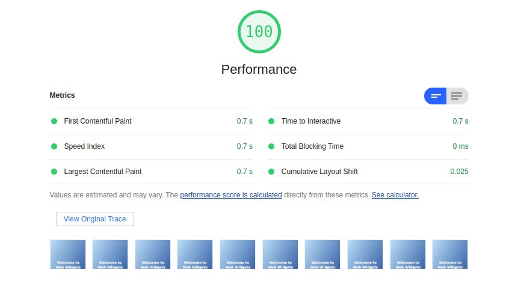
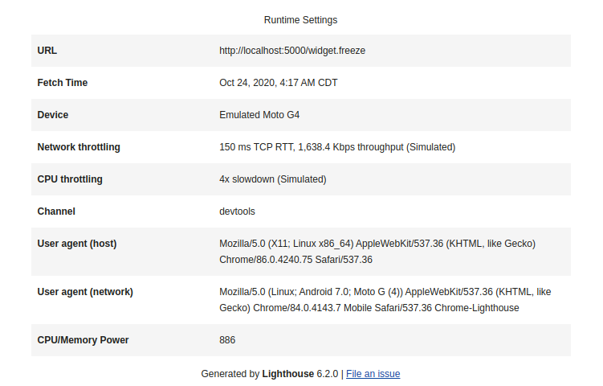
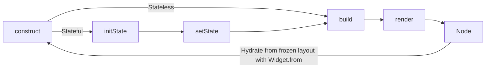
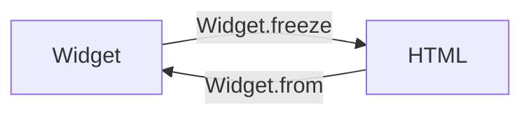
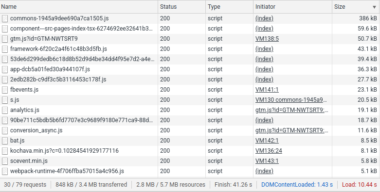
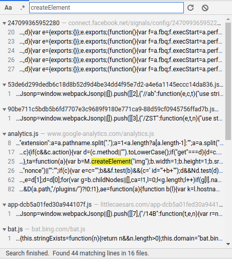
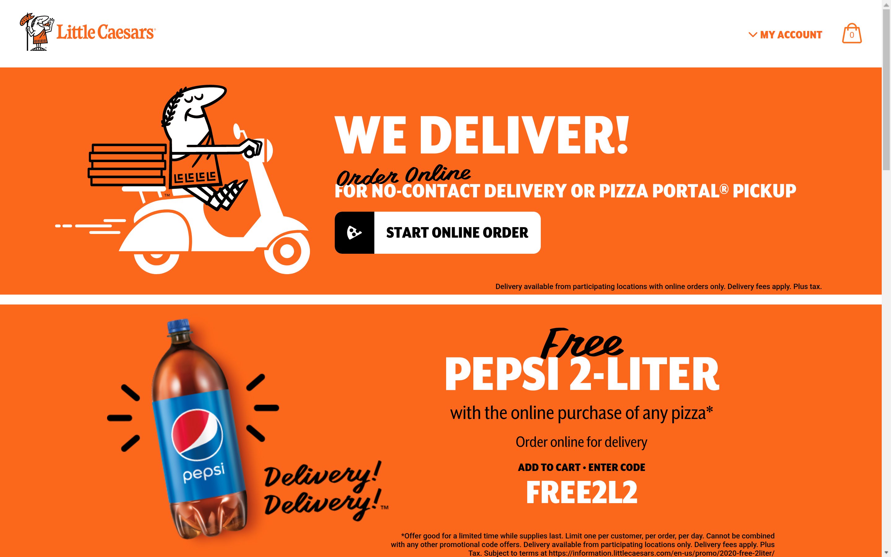
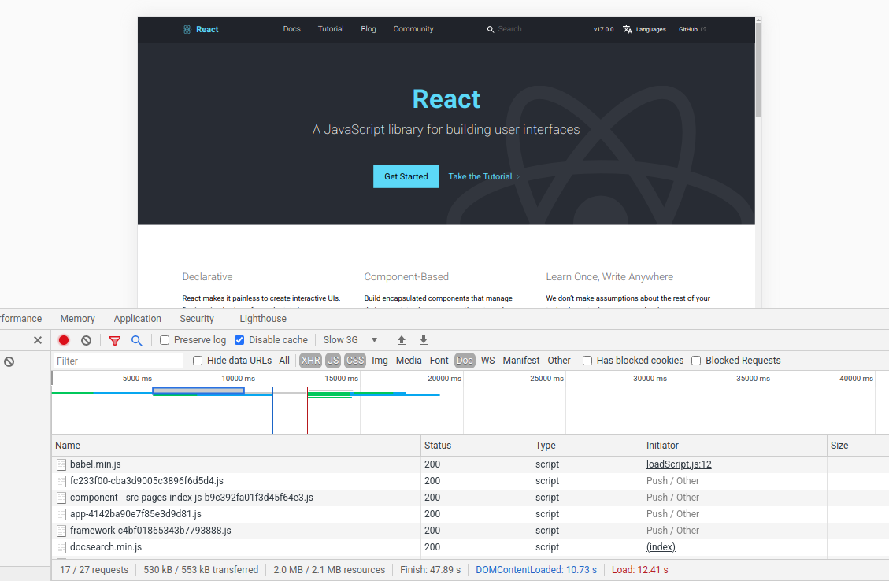

# Web Widgets: AOT-Compilable, Non-Blocking Layouts

### Table of Contents

* [Demo](#demo)
   * [Lighthouse results](#lighthouse-results)
* [What's in a component?](#whats-in-a-component)
* [The Widget Pattern](#the-widget-pattern)
   * [Inheriting constructor metadata as instance defaults](#inheriting-constructor-metadata-as-instance-defaults)
   * [Programming widget trees](#programming-widget-trees)
   * [`build()`, `render()`, and `setState()` methods](#build-render-and-setstate-methods)
   * [Lifecycle](#lifecycle)
      * [Rendering process](#rendering-process)
      * [Freeze/thaw with `Widget.from()` and `Widget.freeze()`](#freezethaw-with-widgetfrom-and-widgetfreeze)
* [Why use Web Widgets?](#why-use-web-widgets)
   * [Declarative components](#declarative-components)
   * [Automatic CSS](#automatic-css)
   * [Easy to debug (dev mode)](#easy-to-debug-dev-mode)
   * [AOT compilation and non-blocking layouts](#aot-compilation-and-non-blocking-layouts)
* [Layout Freezing](#layout-freezing)
   * [What is a "layout freeze"?](#what-is-a-layout-freeze)
   * [How does it work?](#how-does-it-work)
      * [Self-replicating layouts](#self-replicating-layouts)
         * [Embedding state logic](#embedding-state-logic)
         * [Embedding compiled state logic](#embedding-compiled-state-logic)
         * [Frozen vs development layouts](#frozen-vs-development-layouts)
   * [Is this like "server-side rendering" in React?](#is-this-like-server-side-rendering-in-react)
      * [React SSR bundles are less data-efficient](#react-ssr-bundles-are-less-data-efficient)
      * [React SSR bundles are less performant](#react-ssr-bundles-are-less-performant)
      * [Frozen layouts are "ready to paint"](#frozen-layouts-are-ready-to-paint)
      * [Real-world examples](#real-world-examples)
* [Footnotes](#footnotes)
   * [`Widget.from` does not yet hydrate children](#widgetfrom-does-not-yet-hydrate-children)
   * [`Widget.from` does not yet hydrate class styles from global stylesheet](#widgetfrom-does-not-yet-hydrate-class-styles-from-global-stylesheet)
   * [Redundant CSS output in namespace freezes](#redundant-css-output-in-namespace-freezes)

## Demo

https://storage.googleapis.com/web-widgets-demo/test

### Lighthouse results

700ms render, 7.3kB transferred, 0ms render-blocking on a simulated throughput of ~200kBps.





## What's in a component?

When you load a webpage in a browser, your device is sent HTML in order to render the interface shown to you, which looks like:

```html
<h1 class="heading" styles="color: red" attr="val">Hello world!</h1>
```

This represents an `h1` component (an `HTMLElement`) with a `heading` class and some manual styles, plus some optional, non-reserved attributes like `attr="val"`.

Ultimately this is a bit of *information soup* as far as data representation goes - some native properties are set through reserved attribute names like `class` and `style`, although these are pieces of information that inherently describe what the UI element will *look like*, and the rest of the attributes could theoretically be JSON-encoded and embedded into a single `attributes` attribute. 

There is no real point to doing this, as you would need to run `JSON.decode(...)` and load a bunch of unused data just to read one attribute in the serialized `attributes` object, but *semantically*, to completely describe the standard HTML element, we only need five things:

1. a `tagName` for default styling, native behavior/functionality
2. the styles it inherits via CSS classes
3. a `styles` attribute to specify manual styles
4. non-reserved `attributes` for use in JS-land (and weird stuff like screen readers)
5. its `children`, if any

If we step back a bit and decouple from traditional HTML logic, we only need to know two things in most cases to describe a UI element:

1. `styles`, inherited or manual 

2. its `children`, if any

Except in cases where we wish to take advantage of native browser functionality, like the `a` element for a link, where we need to set the `tagName` to `a`.

## The Widget Pattern

To jump right into the pattern, which is inspired by Flutter's widget paradigm, but with the design goal of being much less awful:

```javascript
/** It's that simple! */
class Link extends Widget { 
    static tag = 'a';
}

/** Instatiate a new Link and set an href. */
new Link('Google.com').setAttributes({
    href: 'https://example.com',
});
```

Rendered via `new Link(...).setAttributes(...).render()`:

```html
<a href="https://example.com" class="Link Widget">Google.com</a>
```

Where the `static tag = 'a'` declaration is used to override the inherited `tag`, which would default to `link` due to the class name. The default `tag`, `style`, and `attributes` for a given widget class can be overridden in this fashion, as detailed below.

### Inheriting constructor metadata as instance defaults

Widgets inherit their constructor's `tag`, `styles`, and `attributes` properties as defaults on initialization. For instance, a new `Link` will be instantiated with the default `.tag` property of `'a'`, such that `new Link().tag === 'a'` evaluates to `true`. 

Defining a widget is effectively defining a piece of metadata that will generate an `HTMLElement`  at `Widget.element` when the `render()` method is called. Notice also that `styles` and `attributes` can be overridden on a widget instance functionally with `.setStyles(...)` and `.setAttributes(...)` methods.

### Programming widget trees

Widget constructors accept variadic `children` as arguments in the form: 

```javascript
new Widget(
    new Widget(...),
    new Widget(
        new Widget(...),
    ),
    ...
)
```

It's best to extend the `Widget` class and set the `static styles = ...` and `static attributes = ...` fields, but for convenience, in-place style/attribute overrides can be accomplished via `setStyles` and `setAttributes`:

```javascript
new Widget(...).setStyles(
    'height: 12px',
    'width: 12px',
).setAttributes({
    data: 'some-val',
})
```

### `build()`, `render()`, and `setState()` methods

`Widget.render(target?)` renders the widget returned by `Widget.build()` into `target`, which defaults to the widget's own `this.element`, i.e., the default behavior with no args is for the widget to rebuild and replace itself in the DOM.

Using `StatefulWidget`, this allows for the following classic stateful counter example (seen in the demo):

```javascript
/**
 * A layout containing a number that increments when a button is pressed.
 */
class CounterView extends StatefulWidget {
  initState() {
    this.state.count = 0;
  }

  build() {
    return new Center(
        new ExtraLargeText(this.state.count),
        new SimpleButton('PRESS ME').on(
            'click',
            this.setState(() => this.state.count++),
        ),
    );
  }
}
```

### Lifecycle

#### Rendering process



###### Diagram source



#### Freeze/thaw with `Widget.from()` and `Widget.freeze()`


###### Diagram source



With `Widget.from(...)`, widget metadata is loaded from the DOM Node: Its `this.attributes` from the Node attributes, its `this.styles` data from the Node's `styles` attribute, and its `this.children`  from the Node's children.

## Why use Web Widgets?

### Declarative components

I find it convenient to define components declaratively like this, and am done working with XML and XML-ish patterns like JSX for building UI. While great for *sending pages to a client device*, HTML is not something a developer should interface with. This approach does not require shadow DOM or custom element support, and is (should be) 100% backwards compatible all the way back to IE10.

### Automatic CSS

By generating, minifying, and embedding CSS style declarations and managing class inheritance automatically, Web Widgets saves you from writing CSS manually and matching class names up, using CSS-in-JS approaches, etc. Just set it and forget it. 


### Easy to debug (dev mode)

By default, elements built from widgets will use the widget class name as the `tagName` and include the widget class name as a DOM `className` (in addition to the inherited class names from their prototype chain). This is a little complicated, and relies on an internal `Inheritable` class (which `Widget` itself extends), but is easily demonstrated via the `Expanded` widget, which is a flex container that aims to fill remaining space around it:

```javascript
/** The actual `Expanded` class definition from this library */
export class Expanded extends Flex {
  static styles = [
    'flex-basis: 0',
    'flex-grow: 1',
    'flex-shrink: 0',

    'width: 100%',
    'height: 100%',

    'max-height: 100%',
    'max-height: -moz-available',
    'max-height: -webkit-fill-available',
    'max-height: fill-available',

    'margin: 0px',
    'padding: 0px',
  ];
}

/** Instatiated via */
new Expanded(...)
```

Generates an element of the form:

```html
<expanded class="Expanded Flex Widget">...</expanded>
```

Where `Expanded` extends `Flex` and `Flex` extends `Widget`, hence an `Expanded` component inheriting all three classes and the associated styles. Looking at a rendered DOM Node will tell you all you need to know, including constructor name and class inheritance chain.

### AOT compilation and non-blocking layouts

Most importantly, the Web Widgets library provides a way for us to easily create extensible components which can be **compiled ahead-of-time** to flat HTML. This allows for optimized performance, maximum dead code elimination, and **non-blocking layouts**.

What is shipped as the freeze, as seen in the demo, is the *full layout*, only Google Fonts are needed – they are loaded without blocking the page render, and the text updates when they're finished. **The initial page render is not blocked by anything.** All of the embedded JS state logic is async, all of the embedded styles are deferred, and no other resources are needed for the initial paint.

See below for more details on the freeze process.

## Layout Freezing

### What is a "layout freeze"?

Layout freezing was the main purpose of developing this library, and was much harder to solve than simply hacking in the extension logic with the `Inheritable` class.

While it is certainly nice to render elements like `<ScrollIndicator class="ScrollIndicator StatefulWidget Widget">` for debugging, and it is a lot of fun using JS to lazily build out the DOM, this is not an optimal way of serving layouts. All of this is great for the development/debugging experience (especially scoping components to JS functions), but there's no need to ship it to a user as a JS-rendered page.

*Optimally*, the layout we send the browser would be *truly* static - as in, not a blank document that will be mutated with `document.createElement` and other JS APIs, but a pure, pre-rendered HTML document that will contain everything needed to display the layout, including embedded styles and state logic. *Optimally*, we would let the browser's HTML parser handle the heavy lifting in building the DOM, and delegate none of that to JS. 

This is not super complicated for a simple component like a heading. Freezing a stateless heading is as simple as embedding the styles and dumping the `outerHTML`, but for stateful widgets with associated JS logic, it is not so simple.

### How does it work?

Interestingly, the only way to do this is to render a layout in such a way that its initial rendered state (first state immediately following the `load` event) contains all the information necessary to reproduce the layout itself, including all possible states. You basically have to leverage the rendered DOM as a transport layer, and regenerate references to your original in-memory widgets using some static method on the constructor, which ended up being called `Widget.from`.

#### Self-replicating layouts

Effectively, it was necessary to design widgets such that they are *self-replicating*, as in, they can render to DOM nodes whose `outerHTML` can be used by some algorithm to reproduce a *complete* copy of the widget itself, and to retain the complete state space of the layout in terms of functionality. Everything that is not used, or is unreachable, is boiled off by the release compilation process, and everything is minimized hence the name-mangling.

This is an insanely abstract and complicated problem initially, *but* -- thinking outside the box gets us there quickly. The feasibility of this process is owed much less to creativity than it is to the gracious maintenance of a little-used DOM API called `document.currentScript`, which is a way to get a reference to the current `<script>` element being processed by the browser, i.e., reference a `<script>` element from inside itself.

##### Embedding state logic

During a freeze, the `StatefulWidget.render()` process will render the widget, and then embed the state logic by appending a `<script>` containing an expression like `WidgetClassName.from(document.currentScript.parentNode).render()` to the rendered DOM Node. This embedded script reproduces ("hydrates") our widget reference and renders it into the original node.

```javascript
/**
 * Embed the state logic to `this.element` if the widget is being frozen.
 *
 * @return {StatefulWidget} this
 */
embedStateLogicIfFrozen() {
    /**
     * For a freeze, embed the state logic for this widget, dereferencing
     * values to their compiled identifiers.
     */
    if (this.frozen) {
        const script = document.createElement('script');
        const sourceClass = this.constructor;

        const expression = (
            `(function(){` +
            `var el=document.currentScript.parentNode;` +
            `requestAnimationFrame(function(){` +
            `${sourceClass.name}` +
            `.${
            dereference(sourceClass, sourceClass.from)
            }(el)` +
            `.${
            dereference(sourceClass.prototype, sourceClass.prototype.render)
            }();});})();`
        );

        /** Append embedded script to `this.element`. */
        script.setAttribute('async', true);
        script.appendChild(document.createTextNode(expression));
        this.element.appendChild(script);
    }

    return this;
}
```

##### Embedding compiled state logic

How do we embed calls like `WidgetClassName.from(...).render()` when we run it through the compiler, given that it would need to look like `a.f(...).g()` if we wanted to embed it in the page and have it work without issues? How do we know what Closure Compiler has renamed our variables to, from *inside* the script?

This gets slightly confusing, but *because* all of this logic is inside the script that's being compield, we actually *do* have references to the right objects at compile-time (`this.constructor` might be called `a` on the global object now, and that might not be naively available to us like ES6 class `.name` properties, but we still have a *reference* to it), we just need to figure out what their identifier names are in the current context. We will also need to export them to the global object, so we can reference them in the document by just embedding a `<script>` element with the variable name like `<script>a.f(...).g();</script>` where `a === window.a === globalThis.a`.

Say we're inside the `Widget` class at compile-time. Interestingly, we have the right reference when we do `const sourceClass = this.constructor`, and`console.log(sourceClass)` in the compiled script would look something like `function a(){this.e=new G();this.d=...}}`. The naming of everything is different, but everything else compiles over (as long as it isn't unreachable). We have direct access to the constructor name via ES6 `.name` property, so `sourceClass.name` will evaluate to `a` as we want, but we need to find the compiled names of `.from()` and `.render()` as well.

If I wanted to be super lazy, couldn't I just exhaustively iterate over all the enumerable properties of `this.constructor`, check if it's strictly equal to `myReference`, and then write the name of the key down if it is?  This naive approach works quite well, and `dereference` is a rather simple function that does just that: It computes name of a property on an object in a way that does not use hard-coded string literals (so it will retain its logic post-compile).

```javascript
/**
 * De-reference a Closure Compiler name-mangled object property.
 *
 * @param {Object!} objectRef
 * The object whose enumerable properties will be searched.
 *
 * @param {Function!} propRef
 * The reference to a function which may or may not be a property on the object.
 *
 * @return {string?}
 * The property name of the matched property, undefined if no match.
 */
export const dereference = (objectRef, propRef) => {
  /**
   * Return ES6 `.name` if exists.
   */
  if (propRef.name) return propRef.name;

  /**
   * Otherwise, search the object for a reference match.
   */
  else for (const propName in objectRef)
    if (objectRef[propName] === propRef)
      return propName;

  return null;
};
```

Here is the output for `new ScrollIndicator().freeze()` run in a regular JS console:

```html
<scrollindicator class="ScrollIndicator StatefulWidget Widget"><script async="true">(function(){var el=document.currentScript.parentNode;requestAnimationFrame(function(){ScrollIndicator.from(el).render();});})();</script></scrollindicator>
```

 And the same statement, from a compiled script:

```html
<w class=""><script async="true">(function(){var el=document.currentScript.parentNode;requestAnimationFrame(function(){.b(el).j();});})();</script></w>
```

##### Frozen vs development layouts

For an example of how the frozen production layout differs from the rendered dev layout, first see the source code for the dev version below.

```html
<body class="BodyWidget Widget">
    <scrollindicator class="ScrollIndicator StatefulWidget Widget">
        <script async="true">(function () { var el = document.currentScript.parentNode; requestAnimationFrame(function () { ScrollIndicator.from(el).initState(); }); })();</script>
    </scrollindicator>
    <expanded class="Expanded Flex Widget" style="background: linear-gradient(to top left, #003c8f, #5e92f3); padding: 2rem;">
        <center class="Center Flex Widget">
            <pageview class="PageView Block Widget">
                <h1 class="Heading1 TextWidget Widget" style="color: white; font-family: 'Work Sans', sans-serif; font-weight: 800;">
                    Welcome to Web Widgets
                </h1>
                <h2 class="Heading2 TextWidget Widget" style="color: white; font-family: 'Public Sans', sans-serif; font-weight: 400;">
                    This stateful layout was shipped as 7kB of static, gzipped data from the edge with Google Cloud CDN.
                </h2>
            </pageview>
        </center>
    </expanded>
    <expanded class="Expanded Flex Widget" style="padding:2rem">
        <center class="Center Flex Widget">
            <pageview class="PageView Block Widget">
                <h1 class="Heading1 TextWidget Widget" style="font-family: 'Work Sans', sans-serif; font-weight: 800;">
                    Thanks for checking it out!
                </h1>
            </pageview>
        </center>
    </expanded>
</body>
```

Notice how the stateful `ScrollIndicator` has its replication logic embedded, which "hydrates" a widget instance from a reference to the current `<script>` element, and finally calls the `render()` method to paint the widget. The `initState()` method is called for a `StatefulWidget` in its constructor, i.e. when a new widget is initialized.

For a frozen production layout, this embedded state logic will generate a reference to the compiled constructor, which has been globally exported to the `head` element and compiled by Closure Compiler (notice that `ScrollIndicator.from(el).render()` has been compiled to `Y.from(el).m()`). Additionally, every widget `tagName` is set to `w` for minification unless overridden via `Widget.tag` in order to remove as much redundant code as possible.

All of the CSS and necessary JS are embedded (compiled and minified) in the `head` element. Because the CSS is rendered AOT from inside the compiled JS, the CSS is automatically minified and scoped by the Closure Compiler pass, and compiled CSS class names match up with compiled JS class names.

The following is the frozen page body (prettified for display here):

```html
<body class="R y">
    <w class="Y B y">
        <script async="true">(function () { var el = document.currentScript.parentNode; requestAnimationFrame(function () { Y.from(el).m(); }); })();</script>
    </w>
    <w class="J H y" style="background:linear-gradient(to top left,#003c8f,#5e92f3);padding:2rem">
        <w class="I H y">
            <w class="Z C y">
                <h1 class="E D y" style="color:#fff;font-family:'Work Sans',sans-serif;font-weight:800">Welcome to Web Widgets</h1>
                <h2 class="F D y" style="color:#fff;font-family:'Public Sans',sans-serif;font-weight:400">This stateful
                    layout was shipped as 7kB of static, gzipped data from the edge with Google Cloud CDN.</h2>
            </w>
        </w>
    </w>
    <w class="J H y" style="padding:2rem">
        <w class="I H y">
            <w class="Z C y">
                <h1 class="E D y" style="font-family:'Work Sans',sans-serif;font-weight:800">Thanks for checking it out!
                </h1>
            </w>
        </w>
    </w>
</body>
```

This test layout weighs **7.2kB** gzipped, and is loaded by **one network request**. Google Fonts in the test layout are embedded with `AsyncStylesheet` widgets, which follow best practices to load stylesheets in a non-blocking way:

```javascript
/**
 * Load a stylesheet asynchronously, or synchronously if not supported.
 *
 * @see https://web.dev/defer-non-critical-css/
 */
export class AsyncStylesheet extends DocumentFragmentWidget {
  /**
   * Create a new async/noscript stylesheet pair.
   *
   * @param {{
   *  href: string!,
   * }} attributes
   */
  constructor(attributes = { href: '' }) {
    super(
        new Stylesheet({
          rel: 'preload',
          as: 'style',
          onload: `this.onload=null;this.rel='stylesheet'`,
          ...attributes,
        }),
        new NoScript(
            new Stylesheet({
              ...attributes,
            }),
        ),
    );
  }
}
```

There is much room for optimization, as the library is still at a proof-of-concept stage and the Closure Compiler step can be heavily iterated on. For instance, in this proof of concept, all used CSS styles are embedded in the output twice when they do not need to be. They are already embedded in a `<style>` element in `document.head` for the frozen layout, yet compiled classes in the release namespace contain redundant `Widget.styles` declarations like `a.f='cursor:pointer;height:24px;...'.split(';')`, which is redundant since the class styles will be generated at runtime by parsing the embedded stylesheet. This is mostly straightforward since we know the constructor name to use for `constructor.from()`, and to search for in the `style#ww-styles` stylesheet, for a given DOM Node because its most specific class will be the first in its `className` attribute, i.e. `<w class="a Y f">` will use `a.from(...)` and look for a `.a { … }` declaration in the `#ww-styles` stylesheet.

### Is this like "server-side rendering" in React?

This is process is *roughly* analogous to React's "server-side rendering", except React tends to generate a whole runtime which will add half a megabyte (or more) to your output as a `script` tag, which will end up mutating the DOM and performing the initial page render dynamically via DOM mutations, the loading of expensive stylesheets and third party scripts, etc. This is commonly excused as "no big deal", but it does compound rather quickly.

#### React SSR bundles are less data-efficient

The *example* (and stateless) React and Gatsby project build sizes are about an order of magnitude larger in terms of transmission size (with no extra runtime NPM dependencies, very rare in practice) than the Web Widgets demo (which is stateful), all to encode a simple layout that can be optimally represented in no more than 4-5kB of static HTML (especially for Gatsby's default starter).

See below for production examples of how this scales in practice with respect to app size. 

#### React SSR bundles are less performant

With React bundles, even with SSR approaches like Gatsby, time is spent blocking the layout and running unnecessary (not related to the layout state or app logic) JS, manipulating the DOM, and so on. In theory, you could defer all of this and not block the initial paint, but the initial paint would be incomplete (or totally blank), unlike what you would see with a frozen layout, where the first paint would be the regular layout minus any asynchronously loaded fonts, which would be applied after they are loaded with `display: swap`.

React SSR bundles get worse with scale - take a look at [Little Caesar's production Gatsby app](https://littlecaesars.com/), which sends over 800kB down the wire in JS/CSS/HTML in 30 or so different requests.



This 800kB unzips to 2.8MB of content that will need to be evaluated by the browser because it is either:

- HTML to be parsed; and/or
- CSS to be parsed and painted; and/or
- JS to be executed, typically involving DOM mutations, which will also then need to be painted; and/or
- Straight-up dead code that does not need to be there; and/or
- One of 3,000 requests made to various pieces of code due to the regressive practice of [code-splitting](https://reactjs.org/docs/code-splitting.html), which this library aims to avoid by compiling each layout down to self-contained HTML. 


Hardly rendered on the server, in practice. We are shipping millions and millions of bytes of JS to the client device and telling it how to render a basic 4-panel layout that hardcore CSS grid people (not me) could probably render in half a kilobyte with one line of HTML. That's not necessarily realistic, but the limit is probably somewhere around there.

#### Frozen layouts are "ready to paint"

If we consider layout freezing to be true "server-side rendering" because frozen layouts are completely non-blocking and ready to paint, then we might as well not even say React "server-side renders" anything, since the browser ends up sucking tons of script from a server and doing a ton of computation in order to paint the layout. You could call it "server-side optimized", I guess, since it's better than shipping a completely client-side rendered bundle, but the client device still ends up doing the logical work to manually manipulate the DOM for the first paint, rather than sending a *static layout* (not just static files, but a layout that is truly *ready to paint*) which leverages the full power of 20+ years of CSS/HTML parser optimization to get users a page they can interact with ASAP.

While React's *outputs* are static (the files do not change and can be served from a CDN), the resulting *layouts* are not, as they are generated dynamically by extremely expensive runtimes on the client's device (see below, where the [ReactJS website](https://reactjs.org/) ships an entire Babel runtime as part of the page). The nature of the served bundle and the nature of the produced layouts in the browser are not usually thought of as distinct, but I am making this distinction right now. If we accept that the files are static, but the layout is not, it is hardly accurate to say that a *Gatsby or React site* is *itself* static, either.



Tons of dynamic rendering, excessive polyfills, and `document.createElement` calls. There is no reason for any of this code to hit a user's device. It may be a necessary intermediary when representing all this complicated JS logic in our *source*, for the sake of developer experience, but there is no reason to send all of this junk to a device for rendering. There is nearly *four megabytes* of dead and/or useless source code in the various different output files, and while gzip saves this page from being totally unusable by trimming off 75% of the weight, you can't avoid executing all of that unzipped code, and you can't avoid the fact that **this much code isn't needed to render a menu and some calls-to-action**.

#### Real-world examples

In reality, it's much worse than I've let on - it's like React doesn't even *try* to represent layouts efficiently: 



*This* is a 4MB layout? Some flex boxes and a fixed position header could encode this in less than 10kB. On mid- to low-end 3G, you won't get an interactive viewport for 10-30 seconds, which likely affects Little Caesar's conversion rate by a double-digit percentage.

Even React's own website is unnecessarily large, and there's no way this page isn't optimized as much as possible for the sake of defending against the common (and accurate) complaint that React is wasteful in terms of data usage.



*You mean we **don't** need to send 2MB of runtime (500kB down the wire) to render a simple page, like some text and a few buttons?*

I do. The React homepage can be rendered on a client device without losing a drop of functionality with no more than 10kB, and I can say that confidently. There's not even a login flow, there's nothing to this page - it is flat CTA layout with some buttons, that's *it*. You can likely do it in 3kB (excluding assets, including fonts), but I'd bet on 10kB.

## Footnotes

### `Widget.from` does not yet hydrate children

Todo.

### `Widget.from` does not yet hydrate class styles from global stylesheet

Todo.

### Redundant CSS output in namespace freezes

Todo.